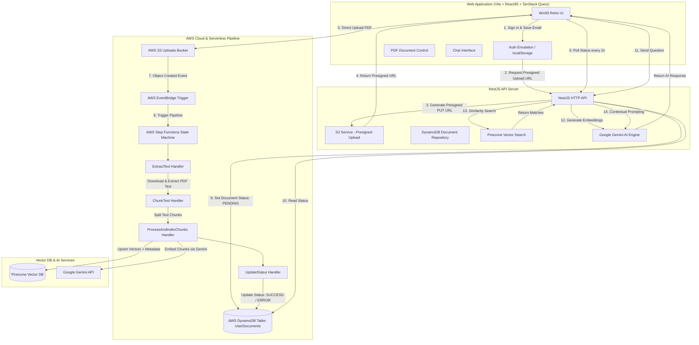

# Full-Stack PDF RAG Assistant (Next/React + NestJS + AWS Step Functions + Pinecone + Gemini)

A production-grade Retrieval-Augmented Generation (RAG) system built with a retro Windows 95 UI, NestJS backend API, AWS Step Functions processing pipeline, Pinecone vector database, and Google Gemini AI.

---

## 🏗 System Architecture



---

## 🛠 Tech Stack

| Layer | Technology |
| :--- | :--- |
| **Frontend (`/web`)** | React 19, Vite, `@react95/core`, `@react95/icons`, `@react95/clippy`, TanStack Query v5, Zustand, TailwindCSS |
| **Backend (`/api`)** | NestJS 11, Express, `@aws-sdk/client-dynamodb`, `@aws-sdk/client-s3`, `@pinecone-database/pinecone`, `@google/genai`, Class Validator |
| **Cloud Infrastructure (`/aws`)** | Serverless Framework v3, AWS Lambda (Node.js 22), AWS Step Functions, AWS S3, AWS EventBridge, AWS DynamoDB |
| **AI & Vector Engine** | Google Gemini AI (`text-embedding-004`, `gemini-2.5-flash`), Pinecone Vector Database |

---

## 🚀 Quick Start & Local Development

### 1. Prerequisites
- **Node.js**: `v20+` or `v22+`
- **NPM**: `v10+`
- **AWS Credentials**: AWS Access Key ID and Secret Access Key configured
- **Pinecone Account**: API Key and Index name
- **Google Gemini API Key**: Active Gemini API key

---

### 2. Environment Setup

Copy `.env.example` files in each subproject directory:

```bash
# Backend API (.env)
cp api/.env.example api/.env

# AWS Serverless Pipeline (.env)
cp aws/.env.example aws/.env

# Web Frontend (.env)
cp web/.env.example web/.env
```

#### Key Environment Variables:

##### `api/.env`
```env
PORT=3000
NODE_ENV=development
CORS_ORIGINS=http://localhost:5173

AWS_ACCESS_KEY_ID=your_aws_access_key
AWS_SECRET_ACCESS_KEY=your_aws_secret_key
AWS_REGION=us-east-1
AWS_BUCKET_NAME=pdf-pipeline-dev-pdf-uploads
TABLE_NAME=UserDocuments

GEMINI_API_KEY=your_gemini_api_key
PINECONE_API_KEY=your_pinecone_api_key
PINECONE_INDEX=pdf-documents
```

##### `aws/.env`
```env
TABLE_NAME=UserDocuments
GEMINI_API_KEY=your_gemini_api_key
PINECONE_API_KEY=your_pinecone_api_key
PINECONE_INDEX=pdf-documents
```

##### `web/.env`
```env
VITE_API_URL=http://localhost:3000
```

---

### 3. Run Applications Locally

#### Start Backend API:
```bash
cd api
npm install
npm run start:dev
```
> API runs on `http://localhost:3000`

#### Start Frontend Web Application:
```bash
cd web
npm install
npm run dev
```
> Web runs on `http://localhost:5173`

#### Deploy AWS Step Functions & Lambda Pipeline:
```bash
cd aws
npm install
npm run deploy
```

---

## 📁 Repository Structure

```
.
├── api/          # NestJS backend API server & DynamoDB/S3/Pinecone/Gemini integrations
├── aws/          # Serverless Framework configuration & AWS Step Functions Lambda handlers
├── web/          # React + Vite frontend application with Win95 desktop interface
└── README.md     # Project overview and system architecture
```

---

## 🔒 Key Features & Constraints

1. **Authentication Emulation**: User enters email address, persisted in `localStorage`.
2. **Single PDF Constraint**: Max 1 PDF file (up to 10MB) per user. Re-uploading requires deleting the existing document first.
3. **Presigned S3 Uploads**: Frontend uploads PDF directly to S3 via presigned URLs.
4. **Step Functions Workflow**: Triggered automatically on S3 upload event via EventBridge.
5. **Real-time Status Polling**: Frontend polls document status every 2 seconds via TanStack Query until processing reaches `SUCCESS` or `ERROR`.
6. **RAG Question Answering**: Vector similarity search in Pinecone combined with Google Gemini LLM context prompting.
